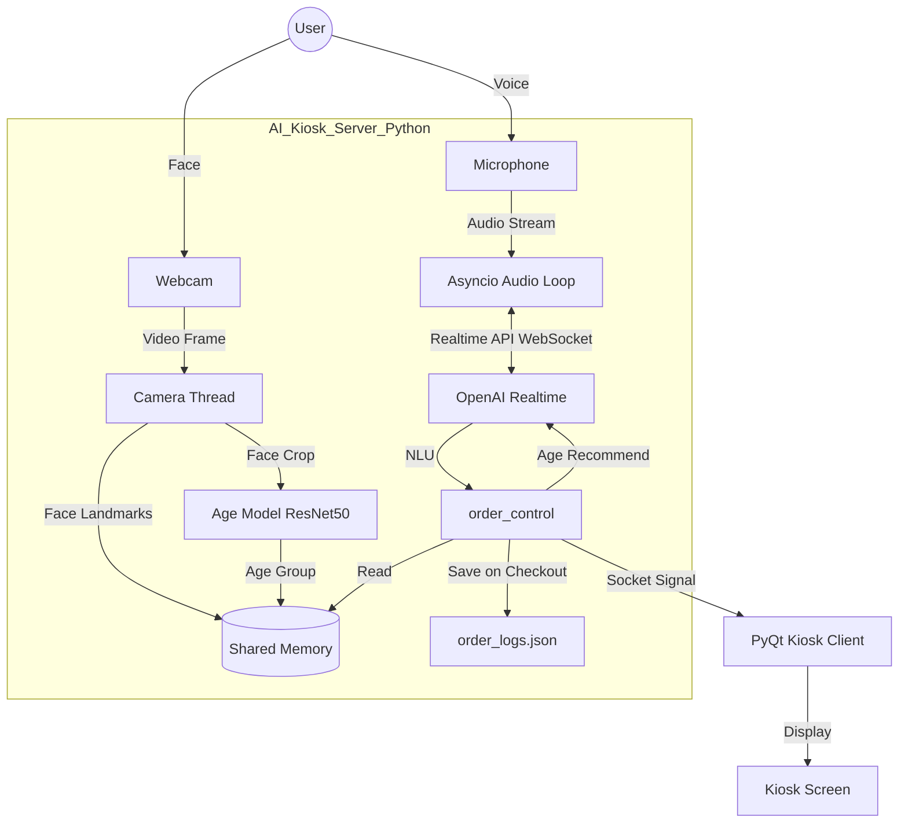

# ☕ AI Smart Kiosk Server with OpenAI Realtime

> **Multimodal AI 기반의 음성 대화형 키오스크 서버 프로젝트**
> 실시간 음성 대화, 안면 인식 데이터 수집, 그리고 키오스크 제어를 통합한 지능형 시스템입니다.

> 🏆 **Note:** 본 프로젝트는 **경상국립대학교 RISE-AI 2025 생성형AI 경진대회** 참여를 위해 개발되었습니다.

---

## 📖 Project Overview (프로젝트 개요)

이 프로젝트는 기존 터치 방식의 키오스크를 넘어, **사람과 대화하듯 주문할 수 있는 "Voice-First" 인터페이스**를 구현하는 것을 목표로 합니다.

OpenAI **Realtime API**를 활용하여 초저지연(Low Latency) 음성 대화를 처리하고, **Mediapipe**를 통해 주문자의 안면 데이터를 실시간으로 분석하여 주문 성향 데이터베이스를 구축합니다. 주문 로그는 **결제 확인 단계**에서 저장되며, 기존 방문 고객(Known)일 경우 이전 주문을 기반으로 추천합니다.

---

## ⚠️ Prototype Limitations (프로토타입 한계)

본 프로젝트는 **프로토타입 단계**의 결과물입니다. 따라서 일부 기능은 UI/기능 측면에서 완전하지 않을 수 있습니다.

- **메뉴 옵션 설정 화면**에서 글자(폰트) 표시 문제가 발생할 수 있습니다.
- **결제 방식** 중 신용/체크카드를 제외한 결제 UI는 폰트 표시 또는 동작이 완전하지 않을 수 있습니다.
- **AI 키오스크 기능**(음성 대화/의도 분석/추천 등)은 개발 중인 기능으로, 환경 설정 또는 모델 상태에 따라 사용이 제한될 수 있습니다.

---

## 🛠️ Tech Stack (기술 스택)

### 🖥️ Backend (AI Core Server)
핵심 로직이 구동되는 서버 파트입니다.

| 구분 | 기술 / 라이브러리 | 사용 목적 |
| :--- | :--- | :--- |
| **Language** |  | 전체 서버 로직 및 비동기 처리 구현 |
| **LLM / AI** | **OpenAI Realtime + GPT-4o 계열** | 음성 STT, NLU 분류, TTS 응답, 키오스크 제어 |
| **Vision AI** | **Mediapipe (Face Mesh)** | 468개의 안면 랜드마크(Landmarks) 실시간 추출 및 분석 |
| **Vision Tool** | **OpenCV** | 웹캠 영상 스트림 캡처 및 전처리 |
| **Network** | **Socket (TCP/IP)** | 프론트엔드(키오스크 클라이언트)와의 실시간 명령 송수신 및 결제 확인 |
| **Concurrency** | **Asyncio & Threading** | 오디오 스트리밍(Async)과 영상 처리(Thread)의 병렬 처리 |

### 🖥️ Frontend (Kiosk Client)
*(※ 본 레포지토리는 서버 코드를 포함하며, 클라이언트는 소켓으로 연결됩니다.)*
* **Role:** 사용자에게 메뉴 UI를 보여주고, 서버로부터 받은 주문 명령을 시각적으로 반영.
* **Communication:** TCP 소켓을 통해 서버와 연결 (`127.0.0.1:9999`).
* **Action:** `add/inc/dec/set/remove/reset` 명령 수신 시 장바구니 UI 업데이트, 결제 확인 단계 표시.
* **Reference:** 이 프로젝트의 프론트엔드 구조는 [guaba98/mega_kiosk](https://github.com/guaba98/mega_kiosk) 리포지토리를 참조 및 활용하여 구현되었습니다.

---

## 📊 System Architecture (시스템 구조)

<div align="center">



</div>

---

## 🚀 Development Environment Setup (개발 환경 설정)

### 📋 Prerequisites (필수 사항)

#### 1. Python 버전
- **Python 3.10 이상** 필요
- 권장: Python 3.10 ~ 3.12

```bash
python --version  # Python 3.10+ 확인
```

#### 2. 하드웨어 요구사항
- **마이크**: 음성 입력을 위한 마이크 (내장 또는 외장)
- **웹캠**: 안면 인식을 위한 카메라
- **스피커**: AI 음성 응답 출력용

#### 3. API 키 발급
- **OpenAI API Key** 필요
  - [OpenAI API Keys](https://platform.openai.com/api-keys)에서 발급

---

### 📦 Installation (설치 방법)

#### Step 1: 저장소 클론
```bash
git clone https://github.com/dltmdwn0147/AI-Kiosk.git
cd AI-Kiosk
```

#### Step 2: 가상환경 생성 및 활성화 (권장)
```bash
# Python 가상환경 생성
python -m venv venv

# 가상환경 활성화
# macOS / Linux
source venv/bin/activate

# Windows
venv\Scripts\activate
```

#### Step 3: 의존성 라이브러리 설치
```bash
# requirements.txt의 모든 패키지 설치
pip install -r requirements.txt
```

**참고 (OS별 설치)**: 일부 시스템에서 `pyaudio` 설치 시 문제가 발생할 수 있습니다.
- **macOS**:
  ```bash
  brew install portaudio
  pip install pyaudio
  ```
- **Windows** (PowerShell):
  ```powershell
  pip install pyaudio
  ```
  *설치가 실패하면 Python 버전에 맞는 `pyaudio` 휠을 설치해야 할 수 있습니다.*

#### Step 4: 환경 변수 설정
프로젝트 루트 디렉토리에 `.env` 파일을 생성하고 OpenAI API 키를 입력합니다:

```bash
# .env 파일 생성
touch .env
```

`.env` 파일 내용:
```env
OPENAI_API_KEY=your_api_key_here
```

**⚠️ 주의**: `.env` 파일은 `.gitignore`에 포함되어 있어 Git에 업로드되지 않습니다. API 키를 절대 공개 저장소에 올리지 마세요!

#### Step 5: 얼굴 랜드마크 모델 다운로드
Mediapipe Face Landmarker 모델이 필요합니다. 아래 스크립트로 다운로드하세요:

```bash
python back/download_model.py
```

다운로드가 완료되면 `back/face_landmarker.task` 파일이 생성됩니다.

#### Step 6: 추천 캐시 파일 생성 (필수)
추천 기능을 사용하려면 아래 캐시 파일을 생성해야 합니다.

**macOS / Windows 공통**:
```bash
cd back
python main.py --build-embeddings
python main.py --build-categories
python main.py --build-subcategories
```

생성되는 파일:
- `back/menu_embeddings.json`
- `back/menu_categories.json`
- `back/menu_subcategories.json`

---

### 🎯 Running the Project (프로젝트 실행)

#### Backend 서버 실행
**macOS / Windows 공통**
```bash
cd back
python main.py
```

**실행 시 확인 사항:**
- ✅ OpenAI Realtime 연결 성공 메시지 확인
- ✅ 웹캠이 정상적으로 작동하는지 확인 (안면 인식 창이 열려야 함)
- ✅ 마이크 권한이 허용되었는지 확인

#### Frontend 키오스크 클라이언트 실행
별도 터미널에서 실행합니다.
```bash
cd front
python mega_kiosk_ver1.py
```

**실행 순서:**
1. **먼저 Backend 서버를 실행** (`back/main.py`)
2. **그 다음 Frontend 클라이언트를 실행** (`front/mega_kiosk_ver1.py`)
3. Frontend는 자동으로 `127.0.0.1:9999` 포트로 Backend에 연결됩니다

---

### 🔧 Troubleshooting (문제 해결)

#### 1. PyAudio 설치 오류
```bash
# macOS
brew install portaudio
pip install pyaudio

# Ubuntu/Debian
sudo apt-get install portaudio19-dev
pip install pyaudio
```

#### 2. OpenCV (cv2) 웹캠 접근 오류
- 웹캠이 다른 프로그램에서 사용 중인지 확인
- 시스템 권한 설정에서 카메라 접근 권한 허용

#### 3. OpenAI API 연결 실패
- `.env` 파일에 올바른 API 키가 입력되었는지 확인
- API 키에 Realtime 모델 사용 권한이 있는지 확인
- 인터넷 연결 상태 확인

#### 4. 소켓 연결 실패
- Backend 서버가 먼저 실행되었는지 확인
- 포트 `9999`가 다른 프로그램에서 사용 중이지 않은지 확인

---

### 📝 Project Structure (프로젝트 구조)

```
AI-Kiosk/
├── back/                     # Backend 서버 코드
│   ├── main.py               # 메인 서버 로직 (OpenAI Realtime, NLU/TTS, 카메라/연령 추정)
│   ├── age_check.py          # 연령 모델 카메라 테스트
│   ├── train_age_model.py    # 연령 모델 학습 스크립트
│   ├── mega_coffee_menu.json # 메뉴 데이터 (JSON)
│   ├── menu_embeddings.json  # 메뉴 임베딩 캐시 (빌드 필요)
│   ├── menu_categories.json  # 메뉴 카테고리 캐시 (빌드 필요)
│   ├── menu_subcategories.json # 메뉴 서브카테고리 캐시 (빌드 필요)
│   ├── face_landmarker.task  # Face Landmarker 모델 (다운로드 필요)
│   └── excel_to_JSON.py      # 엑셀 → JSON 변환 스크립트
│
├── front/                   # Frontend 키오스크 클라이언트
│   ├── mega_kiosk_ver1.py   # 메인 UI 실행 파일 (PyQt5)
│   ├── shopping_cart.py     # 장바구니 모듈
│   ├── manager_page.py      # 관리자 페이지
│   ├── DATA/                # 데이터베이스 및 CSV 파일
│   │   ├── data.db          # SQLite 데이터베이스
│   │   └── *.csv            # 메뉴 및 주문 데이터
│   └── UI/                  # PyQt5 UI 파일 (.ui)
│
├── requirements.txt         # Python 의존성 패키지 목록
├── .env                     # 환경 변수 (API 키 등) - .gitignore에 포함됨
├── .gitignore               # Git 제외 파일 목록
└── README.md                # 프로젝트 문서 (본 파일)
```

---

### 📚 Additional Resources (추가 자료)

- [OpenAI API 문서](https://platform.openai.com/docs/api-reference)
- [PyQt5 공식 문서](https://www.riverbankcomputing.com/static/Docs/PyQt5/)
- [Python Asyncio 가이드](https://docs.python.org/3/library/asyncio.html)

